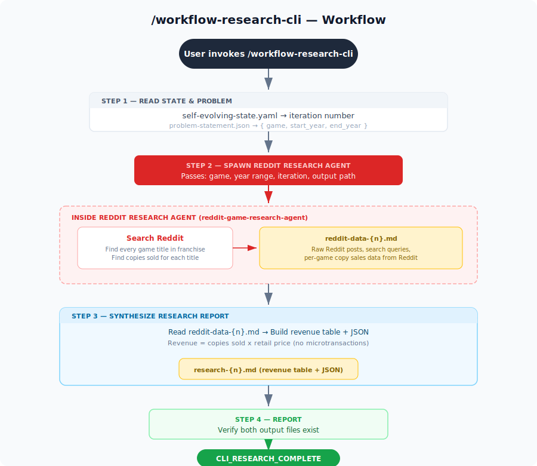

# Self-Evolving Dual-Agent Research System

The **Claude Code CLI** produces ground-truth research output. The **Claude Agent SDK** (FastAPI Python app) is then autonomously evolved until its output matches the CLI at 90%+ similarity.

**Both agents run on your Claude Max subscription** — no API key costs.

## How It Works

1. A research problem is defined in [`problem-statement/problem-statement.json`](problem-statement/problem-statement.json)
2. The **CLI agent** (Claude Code CLI + Reddit MCP) produces the **ground truth** output
3. The **SDK agent** (FastAPI + Claude Agent SDK) independently produces its output
4. A comparator measures how close the SDK output is to the CLI ground truth
5. If < 90% similarity, the self-evolving process **modifies the SDK code** (`agent.py`, `main.py`)
6. If the SDK API **fails**, the process **fixes the code** — no mocking or fallbacks
7. Loop repeats until SDK matches CLI at 90%+ similarity

## CLI Research Flow

<p align="center">
  
</p>

## Self-Evolving Workflow

<p align="center">
  
</p>

## Three Commands

| Command | Purpose |
|---------|---------|
| `/workflow-research-cli` | Reads problem, spawns Reddit research agent for raw data, synthesizes final report |
| `/compare-research` | Compare CLI (truth) vs SDK output — scores similarity |
| `/workflow-self-evolving-loop` | Thin orchestrator — delegates to sub-commands, hits SDK API, evolves SDK |

## Prerequisites

- [Claude Code CLI](https://docs.anthropic.com/en/docs/claude-code) installed (with Max subscription)
- Python 3.10+

No API key needed — both sides use your Claude Max subscription.

## Setup

```bash
# 1. Clone the repo
git clone <repo-url> && cd claude-agent-sdk-vs-claude-code-cli

# 2. Install SDK agent dependencies
cd claude-agent-sdk && python3 -m venv venv && source venv/bin/activate && pip install -r requirements.txt && cd ..
```

## Running

### CLI Research Only (Ground Truth)

```bash
claude --dangerously-skip-permissions -p "Execute /workflow-research-cli" --output-format text
```

### SDK Research Only (Max subscription)

```bash
# Start the server (no API key needed)
cd claude-agent-sdk && source venv/bin/activate && uvicorn main:app --reload --port 8000

# Trigger via curl or Swagger UI (http://localhost:8000/docs)
curl -X POST http://localhost:8000/research-claude-agent-sdk \
  -H "Content-Type: application/json" \
  -d '{"iteration": 1}'
```

### Compare Only

After both agents have produced output:

```bash
claude --dangerously-skip-permissions -p "Execute /compare-research" --output-format text
```

### Full Autonomous Self-Evolving Loop

```bash
# Terminal 1: Start SDK FastAPI app
cd claude-agent-sdk && source venv/bin/activate && uvicorn main:app --reload --port 8000

# Terminal 2: Run the loop (up to 100 iterations)
./ralph.sh 100
```

Each iteration:
1. CLI agent produces ground truth research
2. SDK API is called (if it fails, the workflow fixes the code)
3. Both outputs are compared (CLI = truth)
4. If < 90%: SDK code is evolved to improve output
5. If >= 90%: convergence reached, loop stops

## What Evolves vs What Doesn't

| Evolves (SDK) | Never Changes (CLI) |
|---------------|-------------------|
| `claude-agent-sdk/agent.py` | `.claude/agents/reddit-game-research-agent.md` |
| `claude-agent-sdk/main.py` | `problem-statement/problem-statement.json` |
| `research/sdk-evolution-log.md` | CLI research output files |

## Project Structure

```
ralph.sh                          — Bash loop entry point
prompt.md                         — Loop prompt (triggers /workflow-self-evolving-loop)
problem-statement/
  problem-statement.json          — Research problem definition
.claude/commands/
  workflow-research-cli.md     — CLI research orchestrator (reads problem, spawns agent, synthesizes report)
  compare-research.md             — Comparison command
  workflow-self-evolving-loop.md       — Thin orchestrator (delegates to sub-commands)
.claude/agents/
  reddit-game-research-agent.md  — Reddit research agent 🔴 (never modified)
claude-agent-sdk/
  main.py                         — POST /research-claude-agent-sdk
  agent.py                        — SDK agent (Claude Agent SDK, Max sub)
research/
  self-evolving-state.yaml        — State machine
  research-iterations.yaml        — Score history
  research-status.json            — Status for ralph.sh
  sdk-evolution-log.md            — Log of SDK changes
  research-{n}/                   — Per-iteration outputs
    claude-code-cli/              — CLI outputs (ground truth)
    claude-agent-sdk/             — SDK outputs (evolving)
    comparison-{n}.md             — Comparison report
```

## Changing the Research Problem

Edit [`problem-statement/problem-statement.json`](problem-statement/problem-statement.json). Both agents read this file dynamically.
