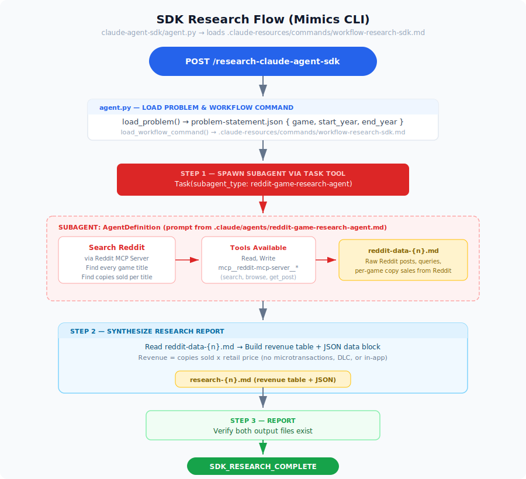
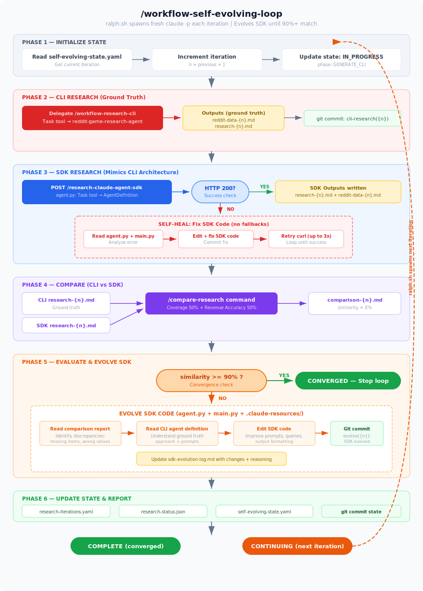

# Self-Evolving Dual-Agent Research System

The **Claude Code CLI** produces ground-truth research output. The **Claude Agent SDK** (FastAPI Python app) mimics the exact same architecture and is autonomously evolved until its output matches the CLI at 90%+ similarity.

**Both agents run on your Claude Max subscription** — no API key costs.

## How It Works

1. A research problem is defined in [`problem-statement/problem-statement.json`](problem-statement/problem-statement.json)
2. The **CLI agent** (Claude Code CLI + Reddit MCP) produces the **ground truth** output
3. The **SDK agent** (FastAPI + Claude Agent SDK) independently produces its output — using the **same architecture** as the CLI (subagents, MCP, Task tool)
4. A comparator measures how close the SDK output is to the CLI ground truth
5. If < 90% similarity, the self-evolving process **modifies the SDK code** (`agent.py`, `main.py`)
6. If the SDK API **fails**, the process **fixes the code** — no mocking or fallbacks
7. Loop repeats until SDK matches CLI at 90%+ similarity

## CLI Research Flow

<p align="center">
  
</p>

## SDK Research Flow (Mimics CLI)

<p align="center">
  
</p>

## Self-Evolving Workflow

<p align="center">
  
</p>

## How the SDK Mimics the CLI

The SDK replicates the CLI's architecture 1:1. Every CLI concept has a direct SDK equivalent:

| Concept | CLI | SDK | How It Maps | Match |
|---------|-----|-----|-------------|-------|
| **Problem source** | Reads `problem-statement/problem-statement.json` | Reads `problem-statement/problem-statement.json` | Same file, same JSON format — `load_problem()` in `agent.py` | ✅ 100% |
| **Research agent** | `.claude/agents/reddit-game-research-agent.md` | `AgentDefinition(prompt=load_agent_prompt())` | SDK loads the **same agent file**, strips YAML frontmatter, passes as `AgentDefinition.prompt` | ✅ 100% |
| **MCP config** | `.mcp.json` auto-loaded by Claude Code | `mcp_servers=load_mcp_config()` from same `.mcp.json` | Same file. SDK loads it explicitly via `load_mcp_config()` | ✅ 100% |
| **Reddit tools** | `mcp__reddit-mcp-server__*` tools | `mcp__reddit-mcp-server__*` tools | Identical MCP tools — search_reddit, get_post_details, browse_subreddit | ✅ 100% |
| **Output schema** | Revenue table + JSON block in `research-{n}.md` | Revenue table + JSON block in `research-{n}.md` | Identical output format — same table columns, same JSON keys | ✅ 100% |
| **Subagent spawning** | `Task tool` with `subagent_type: reddit-game-research-agent` | `Task tool` with `agents: {"reddit-game-research-agent": ...}` | Both use Task tool to spawn. SDK registers via `ClaudeAgentOptions.agents` | ✅ 100% |
| **2-step workflow** | Step 2: spawn agent → `reddit-data-{n}.md`, Step 3: synthesize → `research-{n}.md` | Step 1: spawn agent → `reddit-data-{n}.md`, Step 2: synthesize → `research-{n}.md` | Same 2-step pattern: raw data collection then synthesis | ✅ 100% |
| **Permission mode** | `--dangerously-skip-permissions` | `permission_mode="bypassPermissions"` | Both bypass permission prompts for autonomous operation | ✅ 100% |
| **Workflow command** | `.claude/commands/workflow-research-cli.md` | `.claude-resources/commands/workflow-research-sdk.md` | Both are markdown files with step-by-step instructions. SDK loads its as `system_prompt` | ~90% |
| **Output location** | `research/research-{n}/claude-code-cli/` | `research/research-{n}/claude-agent-sdk/` | Parallel directories under the same `research/` root — only subfolder name differs | ~90% |
| **Entry point** | `claude -p "Execute /workflow-research-cli"` | `POST /research-claude-agent-sdk` | CLI command vs HTTP endpoint — different trigger mechanism, same result | ~80% |

## Three Commands

| Command | Purpose |
|---------|---------|
| `/workflow-research-cli` | Reads problem, spawns Reddit research agent for raw data, synthesizes final report |
| `/compare-research` | Compare CLI (truth) vs SDK output — scores similarity |
| `/workflow-self-evolving-loop` | Thin orchestrator — delegates to sub-commands, hits SDK API, evolves SDK |

## Prerequisites

- [Claude Code CLI](https://docs.anthropic.com/en/docs/claude-code) installed (with Max subscription)
- Python 3.10+

No API key needed — both sides use your Claude Max subscription.

## Setup

```bash
# 1. Clone the repo
git clone <repo-url> && cd claude-agent-sdk-vs-claude-code-cli

# 2. Install SDK agent dependencies
cd claude-agent-sdk && python3 -m venv venv && source venv/bin/activate && pip install -r requirements.txt && cd ..
```

## Running

### CLI Research Only (Ground Truth)

```bash
claude --dangerously-skip-permissions -p "Execute /workflow-research-cli" --output-format text
```

### SDK Research Only (Max subscription)

```bash
# Start the server (no API key needed)
cd claude-agent-sdk && source venv/bin/activate && uvicorn main:app --reload --port 8000

# Trigger via curl or Swagger UI (http://localhost:8000/docs)
curl -X POST http://localhost:8000/research-claude-agent-sdk \
  -H "Content-Type: application/json" \
  -d '{"iteration": 1}'
```

### Compare Only

After both agents have produced output:

```bash
claude --dangerously-skip-permissions -p "Execute /compare-research" --output-format text
```

### Full Autonomous Self-Evolving Loop

```bash
# Terminal 1: Start SDK FastAPI app
cd claude-agent-sdk && source venv/bin/activate && uvicorn main:app --reload --port 8000

# Terminal 2: Run the loop (up to 100 iterations)
./ralph.sh 100
```

Each iteration:
1. CLI agent produces ground truth research
2. SDK API is called (if it fails, the workflow fixes the code)
3. Both outputs are compared (CLI = truth)
4. If < 90%: SDK code is evolved to improve output
5. If >= 90%: convergence reached, loop stops

## What Evolves vs What Doesn't

| Evolves (SDK) | Never Changes (CLI) |
|---------------|-------------------|
| `claude-agent-sdk/agent.py` | `.claude/agents/reddit-game-research-agent.md` |
| `claude-agent-sdk/main.py` | `problem-statement/problem-statement.json` |
| `claude-agent-sdk/.claude-resources/` | `.claude/commands/` |
| `research/sdk-evolution-log.md` | CLI research output files |

## Project Structure

```
ralph.sh                                        — Bash loop entry point
prompt.md                                       — Loop prompt (triggers /workflow-self-evolving-loop)
problem-statement/
  problem-statement.json                        — Research problem definition
.claude/commands/
  workflow-research-cli.md                      — CLI research orchestrator
  compare-research.md                           — Comparison command
  workflow-self-evolving-loop.md                — Thin orchestrator (delegates to sub-commands)
.claude/agents/
  reddit-game-research-agent.md                 — Reddit research agent (never modified)
claude-agent-sdk/                               — FastAPI Python app (EVOLVES each iteration)
  main.py                                       — POST /research-claude-agent-sdk
  agent.py                                      — SDK agent (Claude Agent SDK, Max sub)
  .claude-resources/commands/
    workflow-research-sdk.md                    — SDK workflow command (mirrors CLI command)
research/
  self-evolving-state.yaml                      — State machine
  research-iterations.yaml                      — Score history
  research-status.json                          — Status for ralph.sh
  sdk-evolution-log.md                          — Log of SDK changes
  research-{n}/                                 — Per-iteration outputs
    claude-code-cli/                            — CLI outputs (ground truth)
    claude-agent-sdk/                           — SDK outputs (evolving)
    comparison-{n}.md                           — Comparison report
```

## Changing the Research Problem

Edit [`problem-statement/problem-statement.json`](problem-statement/problem-statement.json). Both agents read this file dynamically.
